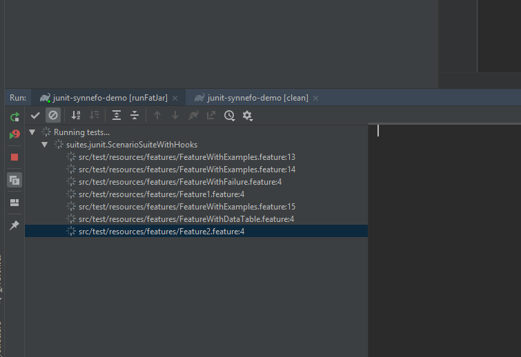
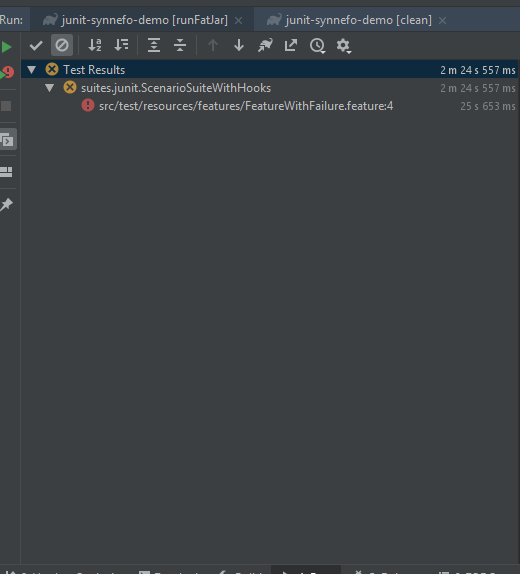
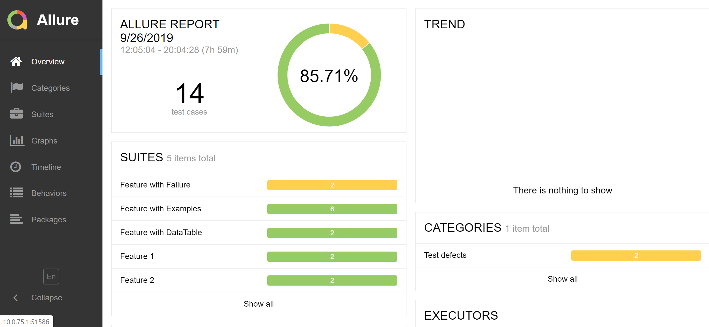

# Synnefo example

This project is an example project for [synnefo](https://github.com/albumprinter/junit-synnefo/), a jvm junit plugin to run cucumber steps in AWS CodeBuild.

# How to run the example?

Prerequisites:
 - [gradle](https://gradle.org/)
 - [allure](https://docs.qameta.io/allure/)

0) git clone this project: `git clone https://github.com/albumprinter/junit-synnefo-demo && cd junit-synnefo-demo`
1) Create a `AWS Codebuild role` and an `S3 bucket` that will be used by the project and set the corresponding environment variables:
```
set Synnefo_serviceRole=arn:aws:iam::9999999999:role/AWS-CodeBuild-Service
set Synnefo_bucketName=9999999999-synnefo
```

(it can also be done via -D parameters or in the code, see: https://github.com/albumprinter/junit-synnefo/pull/15):

2) Configure your AWS credentials by either using aws cli's `aws configure` or set the environment variables:


3.1) Run the gradle command `gradle runSynnefoTests`:


3.2) Or run the gradle task in Intellij IDEA:



And wait for it to finish



4) Go to the reporting directory: `cd build && cd synnefo` and start the allure server: `allure serve .`


5) Enjoy the report


